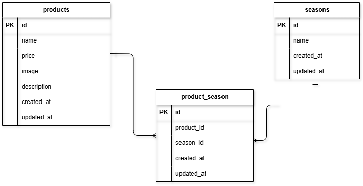

# FashionablyLate(お問い合わせフォーム)

## 環境構築
**Dockerビルド**
1. `git clone git@github.com:risa912/product-form.git`
2. DockerDesktopアプリを立ち上げる
3. `docker-compose up -d --build`

> *MacのM1・M2チップのPCの場合、`no matching manifest for linux/arm64/v8 in the manifest list entries`のメッセージが表示されビルドができないことがあります。
エラーが発生する場合は、docker-compose.ymlファイルの「mysql」内に「platform」の項目を追加で記載してください*
``` bash
mysql:
    platform: linux/x86_64(この文追加)
    image: mysql:8.0.26
    environment:
```

**Laravel環境構築**
1. `docker-compose exec php bash`
2. `composer install`
3. 「.env.example」ファイルを 「.env」ファイルに命名を変更。または、新しく.envファイルを作成
4. .envに以下の環境変数を追加
``` text
DB_CONNECTION=mysql
DB_HOST=mysql
DB_PORT=3306
DB_DATABASE=laravel_db
DB_USERNAME=laravel_user
DB_PASSWORD=laravel_pass
```

> **権限エラーが出る場合**
> 
> ```
> '.env' を保存できませんでした。EACCES: permission denied
> ```
> 下記を実行してください。

```bash
# ディレクトリとファイルの所有者を自分のユーザーに変更
sudo chown -R ユーザー名:ユーザー名 ~/coachtech/review-product/product-form/src

# ファイルやディレクトリの書き込み権限を付与
chmod -R u+rw ~/coachtech/review-product/product-form/src

# 確認
ls -la ~/coachtech/review-product/product-form/src/.env
```

5. アプリケーションキーの作成
``` bash
php artisan key:generate
```

6. マイグレーションの実行
``` bash
php artisan migrate
```

7. シーディングの実行
``` bash
php artisan db:seed
```

> **Laravel ログ権限エラーが出る場合**
> 
> ```
> The stream or file "/var/www/storage/logs/laravel.log" could not be opened in append mode: Failed to open stream: Permission denied
> ```
> …その場合は下記を実行してください。

```bash
# PHPコンテナに入る
docker exec -it product-form-php-1 /bin/bash

# storage と bootstrap/cache の所有者を Web サーバー用に変更
chown -R www-data:www-data /var/www/storage /var/www/bootstrap/cache

# 書き込み権限を付与
chmod -R 775 /var/www/storage /var/www/bootstrap/cache
```


## 使用技術(実行環境)
- PHP8.4.11
- Laravel8.83.29
- MySQL 8.0.43

## ER図


## URL
- 開発環境：http://localhost/products
- phpMyAdmin:：http://localhost:8080/

